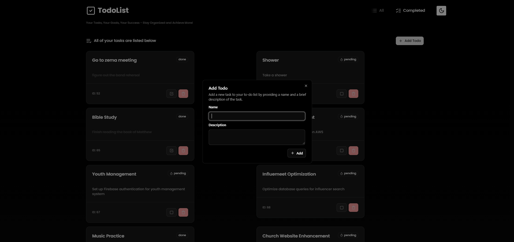
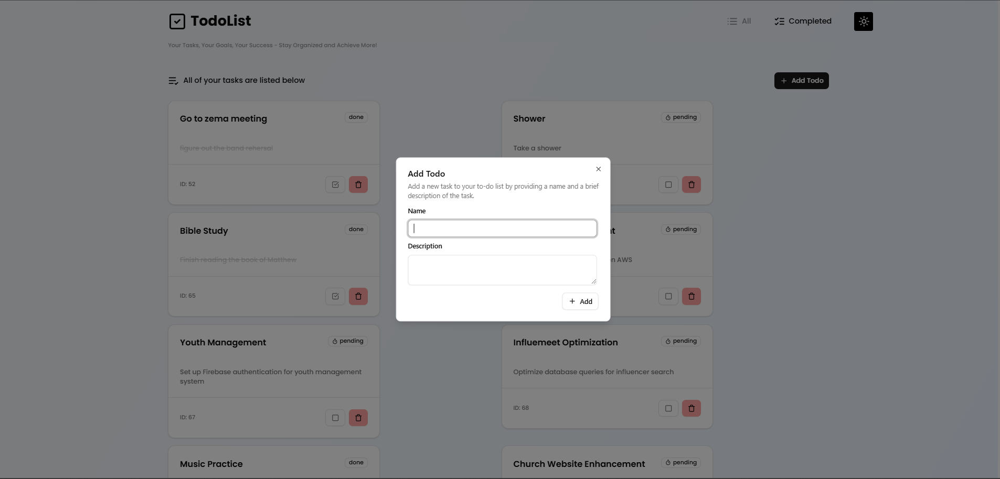

## TodoPHP

- TodoPHP is a simple PHP-based application designed to help users manage their tasks efficiently. It allows users to create, update, and delete tasks, providing an intuitive interface for organizing daily activities. The application is lightweight and easy to set up, making it ideal for personal or small-scale task management needs.

